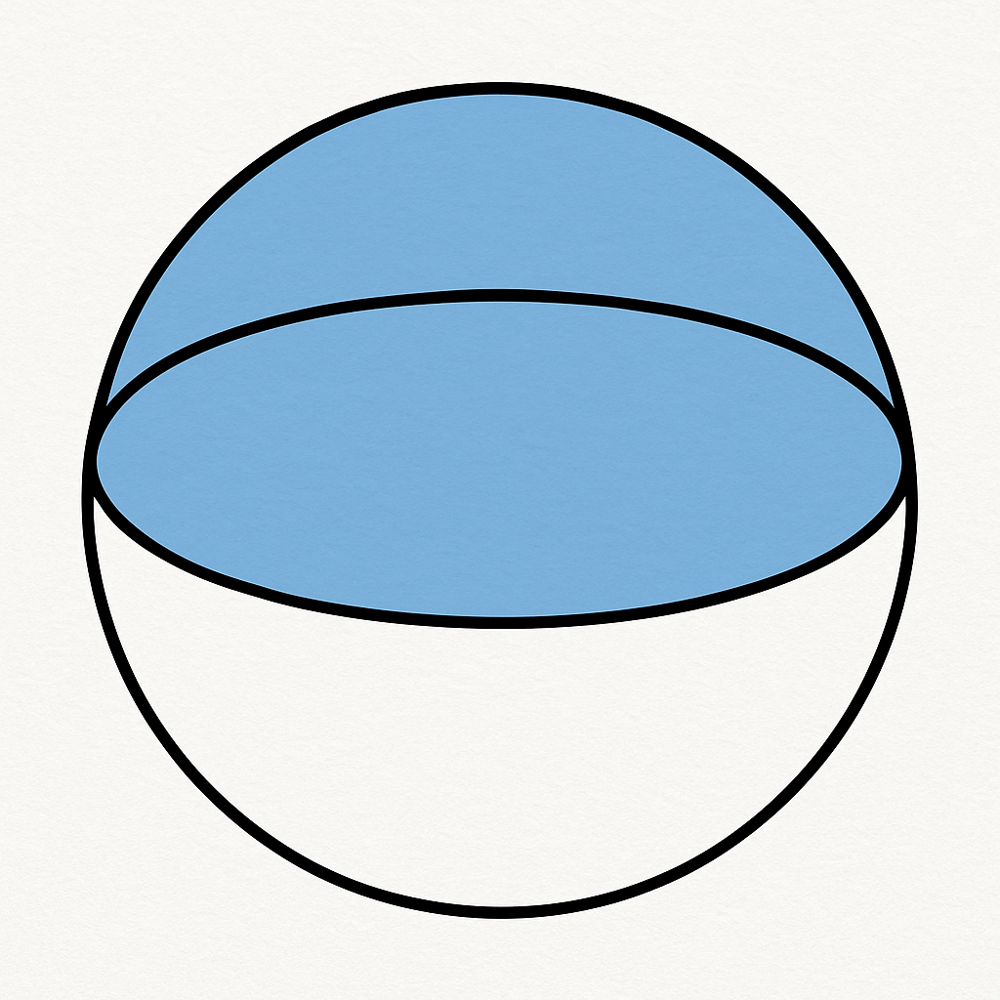

# Problem
  
> Given any five points on a sphere, show that some four of them must lie on a **closed hemisphere**.

---

## Intuition

When I first saw this problem, I decided to simplify it — instead of thinking about a 3D sphere, I imagined a **circle** in 2D.  
On a circle, if you pick any five points, can you always find a semicircle that contains four of them?  
That question hints at using the **pigeonhole principle**, and it turns out the same idea extends beautifully to the sphere.

---

## Step 1: From Two Points to a Great Circle

Any **two distinct points** on a sphere and the **center** of the sphere determine a unique **plane**, because three non-collinear points always do.  
This plane slices the sphere in a **great circle** — a circle whose center coincides with the sphere’s center.

---

## Step 2: Two Closed Hemispheres

That great circle divides the sphere into **two equal halves**, each called a **hemisphere**.  
If we include the great circle itself as part of each half, we call them **closed hemispheres**.

By definition, the two points we started with lie **on the boundary** (the great circle) of both hemispheres.

---

## Step 3: The Pigeonhole Principle in Action

Now, we have **three remaining points** and **two hemispheres**.  
According to the **pigeonhole principle**, at least one hemisphere must contain **at least two** of those three points.

That gives us four points — the two boundary points and the two interior ones — all lying in a single **closed hemisphere**.

---

## Step 4: Why “Closed” Matters

If we used *open* hemispheres (not including the boundary), those two initial points on the great circle would belong to **neither** side.  
By using *closed* hemispheres, we make sure they’re included in both, ensuring the argument holds.

---

## Step 5: General Idea

This is a great example of how **geometric reasoning** and **combinatorial thinking** (like the pigeonhole principle) complement each other.  
The same reasoning extends to higher dimensions: on an *n*-sphere, among any *n + 2* points, some *n + 1* must lie in a closed hemisphere.