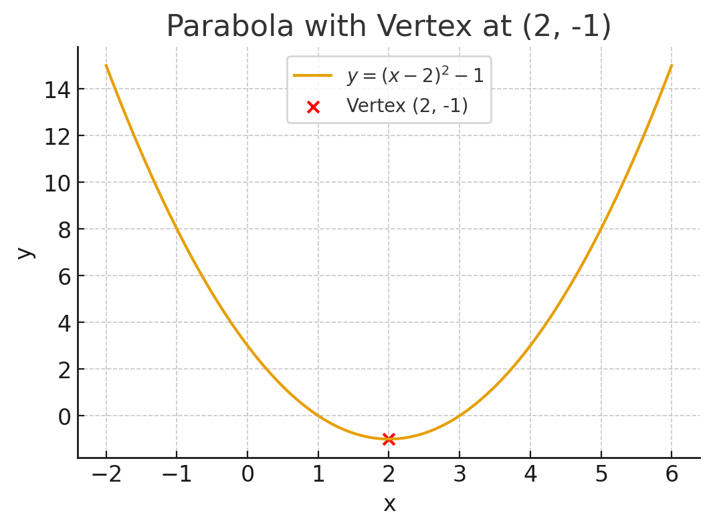

## Problem

> If $f(x) = x^2 - 4x + 3$, what is the minimum value of $f(x)$ for real numbers $x$?

---

## Step-by-Step Solution

### Step 1: Recognize the function type

This is a **quadratic** function:  
$$
f(x) = ax^2 + bx + c = x^2 - 4x + 3
$$  
It opens **upward** (since $a = 1 > 0$), so it has a **minimum** at the vertex.

---

### Step 2: Use the vertex formula

The vertex of a parabola $ax^2 + bx + c$ is at:  
$$
x = -\frac{b}{2a} = -\frac{-4}{2(1)} = 2
$$

---

### Step 3: Plug in the vertex to find the minimum

$$
f(2) = (2)^2 - 4(2) + 3 = 4 - 8 + 3 = -1
$$

---

## Final Answer:

The **minimum value** of $f(x)$ is:  
$$
\boxed{-1}
$$

---

## Visual Insight 

---
